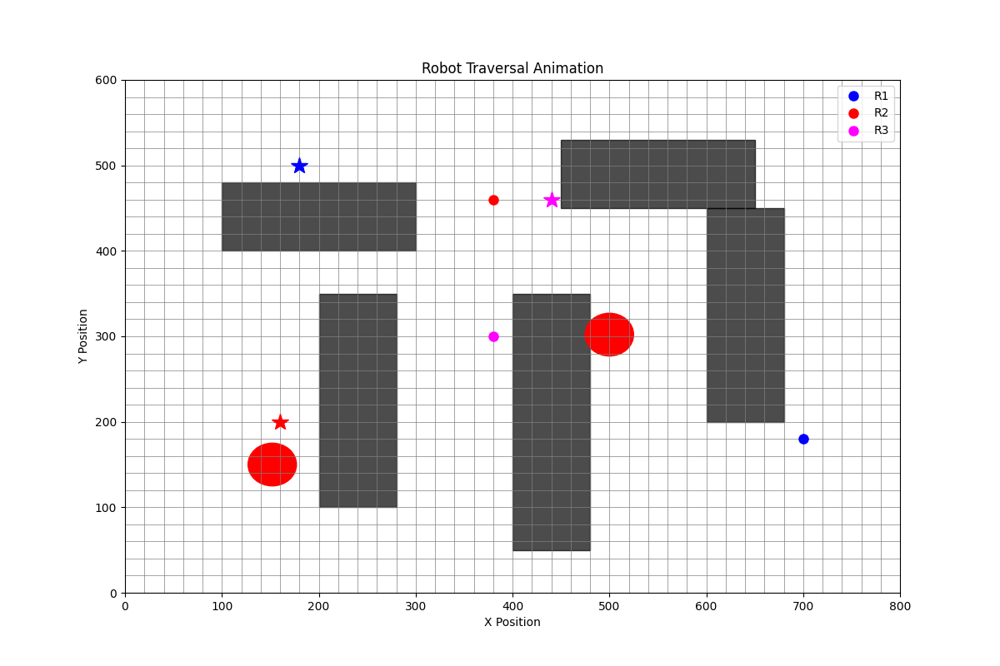
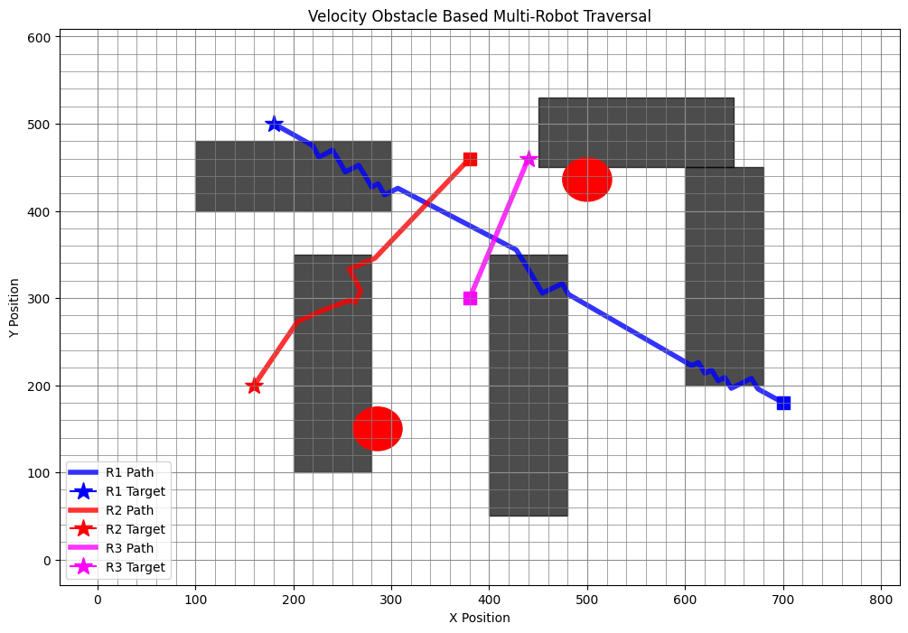

# Velocity Obstacle Based Collision-Free Multi-Robot Traversal in Warehouse Environments

<p align="center">
  
</p>

---

## Overview

This project presents a simulation-based warehouse automation system where multiple autonomous robots navigate toward assigned targets while avoiding collisions using a simplified Velocity Obstacle (VO) algorithm.

The system simulates a realistic warehouse environment containing:
- static warehouse shelves,
- dynamic moving obstacles,
- adaptive robot velocity control,
- collision-free traversal paths.

The project focuses on improving:
- warehouse traversal efficiency,
- robot coordination,
- dynamic collision avoidance,
- path optimization,
- multi-agent autonomous navigation.

---

# Key Features

- Velocity Obstacle Based Collision Prediction
- Multi-Robot Autonomous Traversal
- Dynamic Velocity Optimization
- Static Shelf Avoidance
- Dynamic Obstacle Avoidance
- GIF-Based Real-Time Animation
- PNG Path Visualization
- Adaptive Re-routing
- Stuck Recovery System
- Performance Metrics Tracking
- Collision-Free Navigation
- Success Ratio Verification

---

# Simulation Output

## Final Traversal Visualization

<p align="center">
  
</p>

---

# System Architecture

```text
User Parameters
       ↓
Robot Initialization
       ↓
Velocity Obstacle Prediction
       ↓
Collision Detection
       ↓
Dynamic Velocity Adjustment
       ↓
Obstacle Avoidance
       ↓
Path Optimization
       ↓
GIF & PNG Output Generation
```

---

# Velocity Obstacle Algorithm

The project uses a simplified Velocity Obstacle (VO) approach for predictive collision avoidance.

Instead of reacting only after nearby collision detection, robots:
1. Predict future positions.
2. Estimate unsafe velocity regions.
3. Dynamically adjust movement vectors.
4. Avoid future collisions proactively.

This improves:
- traversal smoothness,
- warehouse coordination,
- movement intelligence,
- success rate.

---

# Mathematical Concepts Used

## Euclidean Distance

\[
d = \sqrt{(x_2 - x_1)^2 + (y_2 - y_1)^2}
\]

Used for:
- target tracking,
- collision detection,
- obstacle avoidance.

---

## Velocity Update

\[
V_x = \frac{dx}{d} \times speed
\]

\[
V_y = \frac{dy}{d} \times speed
\]

---

## Relative Velocity

\[
V_{rel} = V_A - V_B
\]

Used for predictive Velocity Obstacle calculation.

---

## Success Ratio

\[
SuccessRatio =
\frac{CompletedRobots}{TotalRobots}
\]

---

# Warehouse Environment Features

## Static Obstacles
Warehouse shelves simulate realistic industrial storage environments.

## Dynamic Obstacles
Moving obstacles simulate:
- forklifts,
- warehouse workers,
- transport carts.

## Adaptive Navigation
Robots dynamically adjust:
- movement direction,
- traversal velocity,
- collision avoidance behavior.

---

# Technologies Used

| Technology | Purpose |
|---|---|
| Python | Core Simulation |
| Matplotlib | Visualization & Animation |
| Math Module | Distance & Velocity Calculations |
| Random Module | Dynamic Movement |
| Pillow | GIF Generation |

---

# Project Structure

```text
final_year_project/
│
├── main.py
├── robot.py
├── obstacle.py
├── metrics.py
├── config.py
├── outputs/
│   ├── robot_animation_1778761302.gif
│   └── robot_output_1778761302.png
├── README.md
└── requirements.txt
```

---

# Input Parameters

Users can customize:

- Number of Robots
- Maximum Speed (meters/min)
- Safe Distance (meters)
- Time Step (minutes)

---

# Performance Metrics

The system tracks:

- Success Ratio
- Average Velocity
- Total Distance Travelled
- Simulation Time
- Path Verification Status

---

# How to Run

## Install Dependencies

```bash
pip install -r requirements.txt
```

---

## Run the Project

```bash
python main.py
```

---

# Example Parameters

```text
Robots: 5
Speed: 50
Safe Distance: 3
Time Step: 0.001
```

---

# Current Capabilities

- Predictive velocity-based collision avoidance
- Dynamic warehouse traversal simulation
- Multi-robot coordination
- Real-time animated traversal
- Warehouse obstacle handling
- Adaptive movement optimization

---

# Future Enhancements

- A* Pathfinding Integration
- Reinforcement Learning Optimization
- ROS2 Integration
- Real AGV Robot Support
- Congestion Heatmaps
- AI-Based Traffic Coordination
- Real-Time Dashboard System

---

# Applications

- Smart Warehouses
- Logistics Automation
- Autonomous Delivery Systems
- Industrial Robotics
- Swarm Robotics
- Multi-Agent Systems

---

# Research Inspiration

This project is inspired by:
- Velocity Obstacle (VO)
- Reciprocal Velocity Obstacle (RVO)
- ORCA Collision Avoidance
- Multi-Agent Autonomous Navigation Systems

---

# References

1. Steven M. LaValle – Planning Algorithms  
2. Peter Corke – Robotics, Vision and Control  
3. Sebastian Thrun – Probabilistic Robotics  
4. IEEE Papers on Velocity Obstacles  
5. ORCA & RVO2 Multi-Agent Navigation Papers  

---

# Author

## Sourav Maji
Indian Institute of Information Technology (IIIT) Nagpur

Department of Computer Science and Engineering

---
